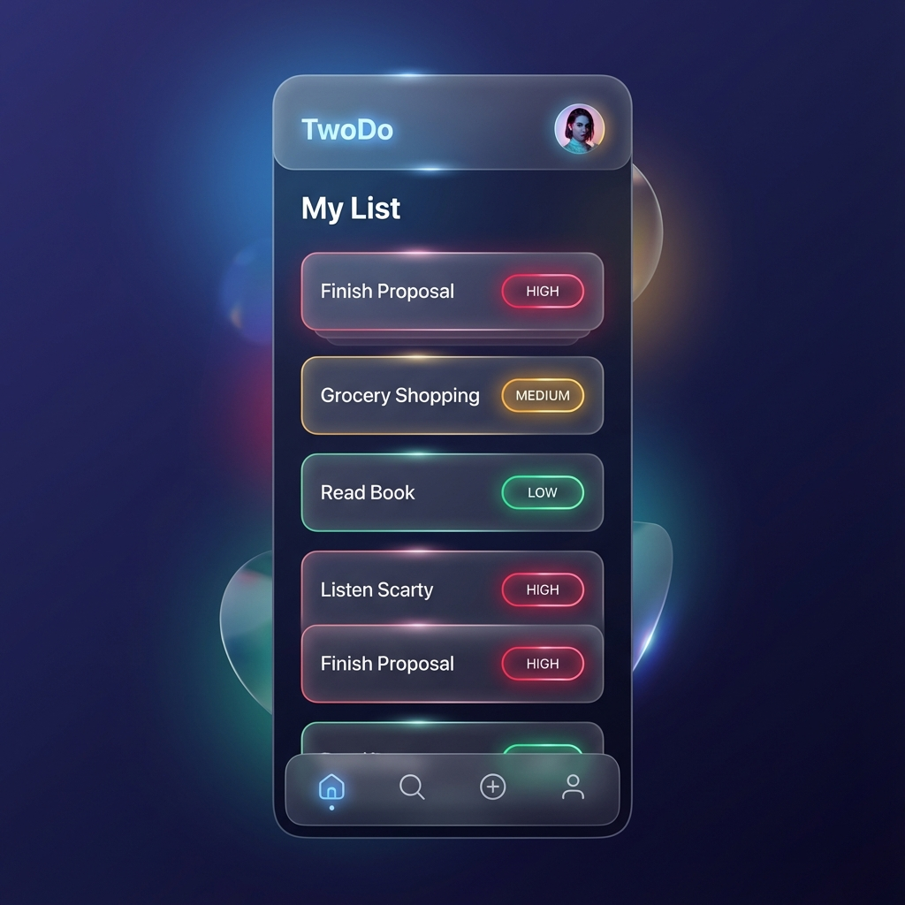

# TwoDo 🥂

TwoDo is a premium, collaborative task management web application designed specifically for couples. It combines a sleek "Neon Glass" aesthetic with a "Hybrid Privacy" model, allowing partners to manage their lives together while maintaining personal space.



## ✨ Features

- **Hybrid Privacy Model**:
  - **Private Tasks**: Only visible to you.
  - **Shared Tasks**: Visible to both partners, with real-time syncing.
- **Partner Assignments**: Assign tasks to yourself, your partner, or keep them unassigned in the shared list.
- **Milestone Celebrations**: 
  - Instant confetti on task completion.
  - "Love & Productivity" animations for hitting weekly goals together.
- **Smart Priority**: Automatic priority adjustment based on upcoming deadlines.
- **Nudge System**: Gently "ping" your partner for reminders with one tap.
- **Neon Glass UI**: A beautiful, mobile-first design with system-adaptive light/dark modes and glowing priority indicators.

## 🚀 Tech Stack

- **Frontend**: React (TypeScript) + Vite
- **Styling**: Vanilla CSS + Framer Motion (Animations)
- **Backend & Auth**: Supabase (PostgreSQL + Google OAuth)
- **Deployment**: Vercel

## 🛠 Setup & Installation

### Prerequisites
- Node.js (v18+)
- A Supabase Project
- Google Cloud Console Project (for OAuth)

### Local Development

1. **Clone the repository**:
   ```bash
   git clone https://github.com/zivharoety/TwoDo.git
   cd TwoDo/app
   ```

2. **Install dependencies**:
   ```bash
   npm install
   ```

3. **Environment Variables**:
   Create a `.env` file in the `app` directory with your Supabase credentials:
   ```env
   VITE_SUPABASE_URL=your_supabase_url
   VITE_SUPABASE_ANON_KEY=your_supabase_anon_key
   ```

4. **Run the development server**:
   ```bash
   npm run dev
   ```

## 📦 Deployment

### Frontend (Vercel)
1. Import the repository into Vercel.
2. Set the **Root Directory** to `app`.
3. Add your `VITE_SUPABASE_URL` and `VITE_SUPABASE_ANON_KEY` to the Environment Variables.

### Backend (Supabase)
Run the `supabase_schema.sql` file in the Supabase SQL Editor to set up the necessary tables (profiles, tasks) and Row-Level Security (RLS) policies.

---

Built with ❤️ by [zivharoety](https://github.com/zivharoety) & antiGravity.
